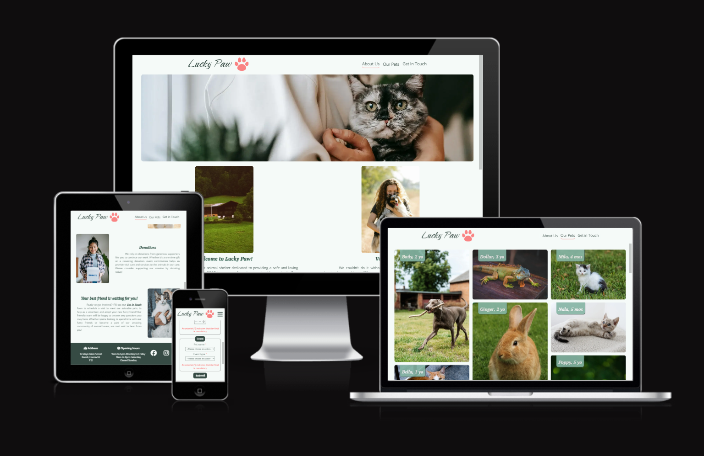
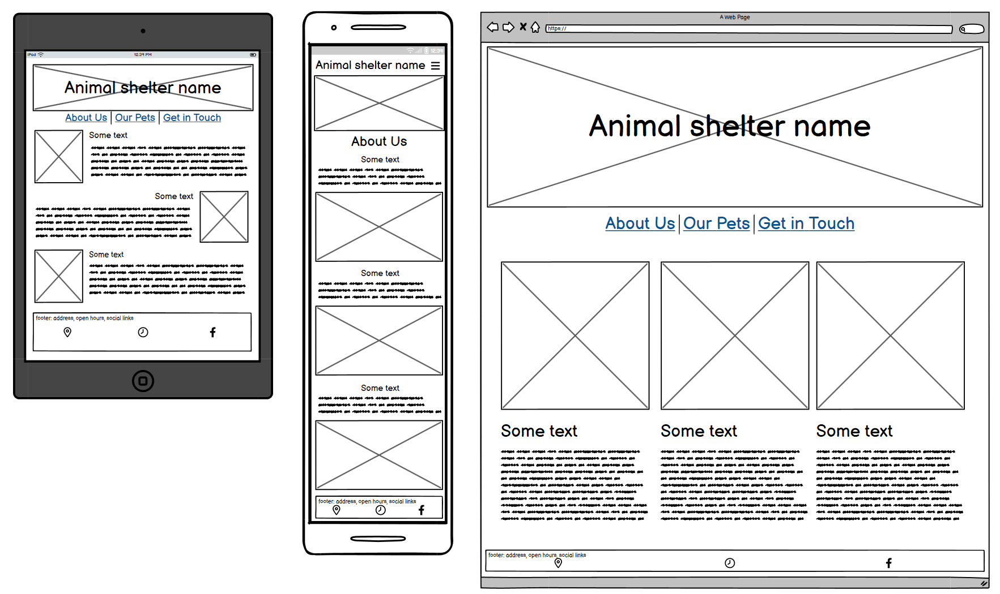
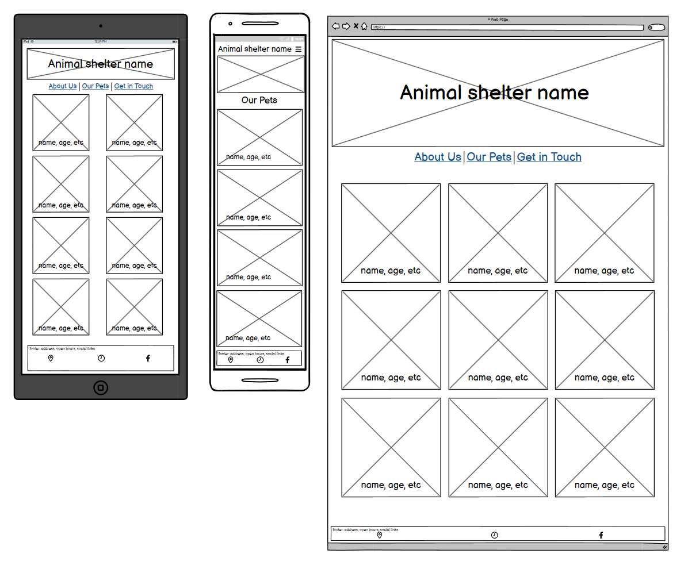
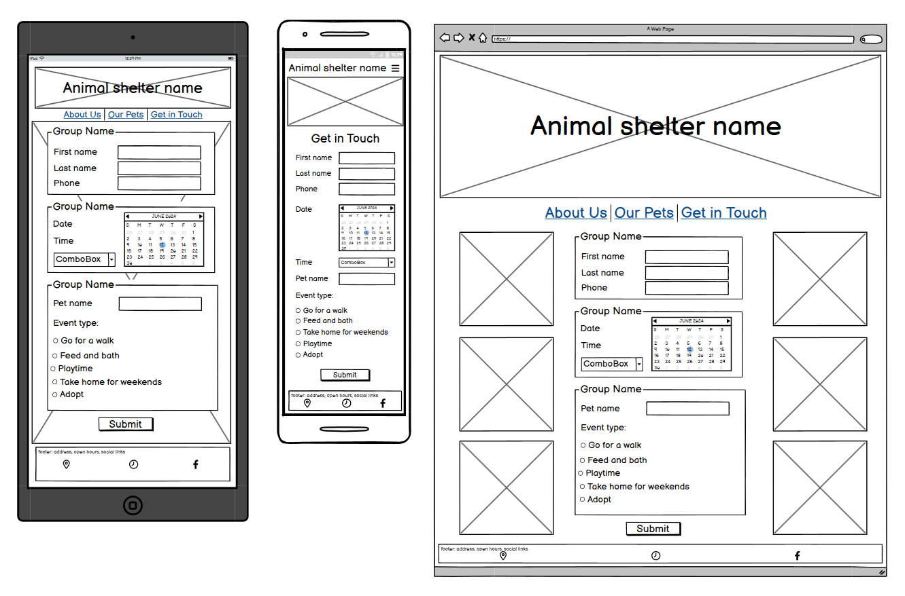

This project is a sample of a website for "Lucky Paw" animal shelter. Its goal is to help people find a pet to adopt. Users can find out about the pets online, schedule a visit and get information about the address and opening hours of the shelter. The website can be extended to include a donation section, events section or visitors` reviews. 

## User Experience (UX)
 ### User stories
 #### 1. User stories based on business goals
- As an animal shelter owner, I want to familiarize users with the shelter and pets, so I can attract potential customers.
- As an animal shelter owner I want to attract families, so I can find new homes for the pets.
- As an animal shelter owner I want to familiarize users with the shelter and pets, so I can encourage them to donate.
#### 2. User stories based on customer needs
- As an ordinary person, I want to get pet information online, so I can save my time and resources. 
- As a shelter visitor, I want to schedule a time and date for a visit, so I can spend time with a particular pet that I like.

 ### Design
- ####  Colour Scheme
  - The main color which was used mostly for background, is #F5FAF8 Harp. Its pair as a main text colour, footer and buttons color is #364B44 Mineral Green. For some shadows and accents was used #85B5A4 Acapulco. For more bright accent was used #F98383 Geraldine. The design was planned as soft, nice to watch and simple.

- ####  Typography 
  - Three fonts are used from Google fonts which are: Catamaran, PT Serif and Exo. Main heading`s font is PT Serif italic. Navigation font is Catamaran and text font is Exo. 

- ####  Imagery
   - The hero image was used at every page of the website as part of the design scheme. The background of the contact page changes 3 times, depending on the screen width for user`s comfort. The gallery page is bright and colorful due to pets images.

## Technologies Used 
 ### Languages Used 
- HTML5 
- CSS3
 ### Frameworks, Libraries & Programes Used
- #### [Google fonts](https://fonts.google.com/knowledge)
Google fonts were used to import the '' font into the style.css file which is used on all pages throughout the project
 - #### [Font Awesome](https://fontawesome.com/)
Font Awesome was used on all pages throughout the website to add icons for aesthetic and UX purposes.
 - #### [Git](https://gitpod.io/)
Git was used for version control by utilizing the Gitpod terminal to commit to Git and Push to GitHub.
  - #### [GitHub](https://github.com/)
GitHub is used to store the projects code after being pushed from Git.
 - #### [Balsamic](https://balsamiq.com/)
Balsamiq was used to create the wireframes during the design process

## Features 

### Existing Features

### Features Left to Implement

## Testing 

### Validator Testing 
- #### HTML
  - No errors or warnings to show.
    - [Home page](./README-images/home_page_validation.png)
    - [Gallery page](./README-images/gallery_page_validation.png)
    - [Contact page](./README-images/contact_page_validation.png)
    - [Confirmation page](./README-images/confirmation_page_validation.png)
- #### CSS
  - No errors or warnings to show. (Except the warning about imported Google Fonts "Imported style sheets are not checked in direct input and file upload modes")
    - [CSS validation](./README-images/css_validation.png)
- #### Accessibility and perfomance
  - Using
    - [Home page](./README-images/)
    - [Gallery page](./README-images/)
    - [Contact page](./README-images/)
    - [Confirmation page](./README-images/)

### Unfixed Bugs

## Deployment
- Github pages
    - This project was deployed to GitHub Pages using the following steps
      - Log in to GitHub and locate the GitHub Repository
      - At the top of the Repository (not top of page), locate the "Settings" Button on 
        the menu.
      - Scroll down the Settings page until you locate the "GitHub Pages" Section.
      - Under "Source", click the dropdown called "None" and select "Master Branch".
      - The page will automatically refresh.
      - Scroll back down through the page to locate the now published site link in the "GitHub Pages" section.
      - live link for the page can be found here [Lucky Paw](https://vl-ocean.github.io/lucky-paw/index.html)
- Forking the GitHub Repository
    - By forking the GitHub Repository we make a copy of the original repository on our GitHub account to view and/or make changes without affecting the original repository by using the following steps
     - Log in to GitHub and locate the GitHub Repository
     - At the top of the Repository (not top of page) just above the "Settings" Button on the menu, locate the "Fork" Button.
     - You should now have a copy of the original repository in your GitHub account.
- Making a Local Clone
   - Log in to GitHub and locate the GitHub Repository
   - Under the repository name, click "Clone or download".
   -  To clone the repository using HTTPS, under "Clone with HTTPS", copy the link.
   - Open Git Bash
   - Change the current working directory to the location where you want the cloned directory to be made
   - Type git clone, and then paste the URL you copied in Step 3.
      - $ git clone https://github.com/YOUR-USERNAME/YOUR-REPOSITORY
   - Press Enter. Your local clone will be created.

## Credits 

  - Tutorials & Content
    - [Love Running project](https://github.com/Code-Institute-Solutions/love-running-v3)
    - [Code institute](https://learn.codeinstitute.net/)
    - [W3Schools](https://www.w3schools.com/)
    - [MDN](https://developer.mozilla.org/en-US/)
    - [Lake-dippers Readme](https://github.com/tmarkec/Lake-dippers)
    - [Bark 'n bath Readme](https://github.com/vtoth13/bark-n-bath/blob/main/README.md)    

  - Graphics
    - [ColorSpace](https://mycolor.space/)
    - [Adobe Color Contrast Checker](https://color.adobe.com/create/color-contrast-analyzer)
    - [Tinify image optimizer](https://tinypng.com/)
    - [Font Awesome](https://fontawesome.com/) 
    - [Name that color](https://chir.ag/projects/name-that-color/#6195ED)
    - [hex to rgba](https://rgbacolorpicker.com/hex-to-rgba)

  - Photos & Logo
    - [Pexels](https://www.pexels.com/) 
    - [Pixabay](https://pixabay.com/de/) 
    - [LOGO](https://logo.com/)

  - Text content
    - [AI Text Generator](https://deepai.org/chat/text-generator)
    - [Fake address Generator](https://countryzipcode.com/fake-address-generator)  

  - Acknowledgment
    - [Cohort Facilitator - Marko](https://github.com/tmarkec) for support in the classroom and guidence through the course.
    - [Mentor - Dick Vlaanderen](https://github.com/dickvla) for support throughout the project, ideas and advices.
    - My sister Anastasiia for help in design and graphic content.
