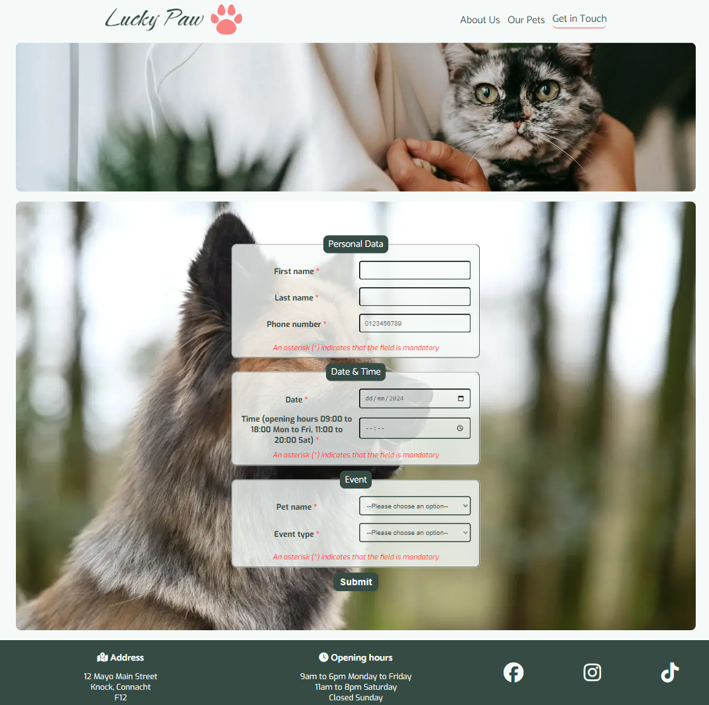

This project is a sample of a website for "Lucky Paw" animal shelter. Its goal is to help people find a pet to adopt. Users can find out about the pets online, schedule a visit and get information about the address and opening hours of the shelter. 

Click here to visit [`Lucky Paw`](https://vl-ocean.github.io/lucky-paw/index.html) website 

## User Experience (UX)

 ### User stories
 #### 1. User stories based on business goals
- As an animal shelter owner, I want to familiarize users with the shelter and pets, so I can attract potential customers.
- As an animal shelter owner I want to attract families, so I can find new homes for the pets.
- As an animal shelter owner I want to familiarize users with the shelter and pets, so I can encourage them to donate.
#### 2. User stories based on customer needs
- As an ordinary person, I want to get pet information online, so I can save my time and resources. 
- As a shelter visitor, I want to schedule a time and date for a visit, so I can spend time with a particular pet that I like.

 ### Design
- ####  Colour Scheme
  - The main color which was used mostly for background, is #F5FAF8 Harp. Its pair as a main text colour, footer and buttons color is #364B44 Mineral Green. For some shadows and accents was used #85B5A4 Acapulco. For more bright accent was used #F98383 Geraldine. The design was planned as soft, nice to watch and simple.

- ####  Typography 
  - Three fonts are used from Google fonts which are: Catamaran, PT Serif and Exo. Main heading`s font is PT Serif italic. Navigation font is Catamaran and text font is Exo. 

- ####  Imagery
   - The hero image was used at every page of the website as part of the design scheme. The background of the contact page changes 3 times, depending on the screen width for user`s comfort. The gallery page is bright and colorful due to pets images.

## Technologies Used 

 ### Languages Used 
- HTML5 
- CSS3

 ### Programes Used
 - #### [Git](https://gitpod.io/)
Git was used for version control by utilizing the Gitpod terminal to commit to Git and Push to GitHub.
  - #### [GitHub](https://github.com/)
GitHub is used to store the projects code after being pushed from Git.
  - #### [GitPod](https://www.gitpod.io/)
Gitpod was used as a platform to develop code in ready-to-code developer environment.
 - #### [Balsamic](https://balsamiq.com/)
Balsamiq was used to create the wireframes during the design process

## Existing Features 
The website has four pages. Each page has a heading with logo and navigation bar (icon for mobile) and a footer.

- ### Logo

 #### It informs the user about organisation's name. It's also clickable and returns the user to the main page from any other page on the website.

- ### Navigation

 

 #### The navigation bar provides the structure of the website. It shows the user what page it is on the screen. It gives the user an ability to move to any other page on the website.

- ### Footer

 #### The footer is devided into three sections. User can find an addfress, opening hours and links to the social media, which opens in a separate tab.

- ### Hero image

 #### It attracts the user attention, showing the cat in the woman's hands, it encourages the user to experience the happiness of having a pet. The hero image is present on all pages as part of the design.

- ### Home page 

 #### It contains of four images, each having a heading and paragraph. The images are supporting the content of the paragraph, increasing its effect. The layout of the images and text are chaning depending on the device (mobile, tablet, desktop).

- ### Gallery page 

 #### The purpose of this page is to introduce the pets to the user. It has a heading and 23 pictures of different pets with their names and age displayed at the top of the pictures. This page gives the user a possibility to choose a future pet and remember the name to use it later in the form.

- ### Contact page / Form

 #### This is the place where the user can schedule the visit to the center. 
 - The general information about the user is required such as name and phone number for contact in case of any changes. The phone number input does not allow to enter letters or more digits than neccessary.
 - The calendar and time parts are provided to eliminate the need to type that information manually. The calendar is set to only allow the user to choose dates from 24.06.2024 to 31.12.2024 and time from 9 am to 8 pm. 
 - The event type is the reason for the visit and there is also a list of pets' names, so that the user can specify who is to be visited/adopted. 

- ### Confirmation page 

 #### The user is assured that the form he filled has been received and will be processed. There is also an email address provided in case the user wants to cancel the appointment later.

## Future features 
- Donation section/page
- News section/page
- Reviews section/page with visitors' reviews or/and pictures.
- The actual Gallery with photos of events or daily life of the pets.
- The button at the bottom of the home page and/or gallery page which leads the user straight to contact page if the user wants to fill the form right away.

## Testing 

### Responsiveness
The website was developed from mobile (320px) to desktop (2000px) and was adapted to fit almost all screens. 

Screen resolution | Pass
--- | :---:
320px | &check;
576px | &check;
768px | &check;
992px | &check;
1024px | &check;
1600px | &check;
2000px | &check;

### Supported browsers
The website was tested on the following browsers and is working well:

Browser | Pass
--- | :---:
Chrome | &check;
Opera | &check;
Firefox | &check;
Microsoft Edge | &check;
Savannah | &check;

### Validator Testing 
- #### HTML
  - No errors or warnings to show.
    - [Home page](./README-images/home_page_validation.png)
    - [Gallery page](./README-images/gallery_page_validation.png)
    - [Contact page](./README-images/contact_page_validation.png)
    - [Confirmation page](./README-images/confirmation_page_validation.png)   
- #### CSS
  - No errors or warnings to show. (Except the warning about imported Google Fonts "Imported style sheets are not checked in direct input and file upload modes")
    - [CSS validation](./README-images/css_validation.png)

### Accessibility and perfomance
  - Using Google Lighthouse I confirmed that the website is readable and accessible. It performs well.
    - [Home page](./README-images/home_page_lighthouse.png)
    - [Gallery page](./README-images/gallery_page_lighthouse.png)
    - [Contact page](./README-images/contact_page_lighthouse.png)
    - [Confirmation page](./README-images/confirmation_page_lighthouse.png)

### Fixed Bugs

- Due to images' size Home page and Gallery page were dropping in Perfomance. To avoid it, all images were restocked in a smaller size and converted to Webp format. They were also optimized. As the result, the pages load much faster.

### Unfixed Bugs
- The form cannot be validated to specify the input characters. Currently you can use digits as your name and surname. The day of the week cannot be validated too, the users can choose Sunday, even tho the shelter is closed at this time. The time input allows to choose 9am for Saturday and 8pm for weekdays, which is also incorrect. This can be fixed using JavaScript.

## Deployment
- ### Github pages
    - This project was deployed to GitHub Pages using the following steps
      - Log in to GitHub and locate the GitHub Repository
      - At the top of the Repository (not top of page), locate the "Settings" Button on 
        the menu.
      - Scroll down the Settings page until you locate the "GitHub Pages" Section.
      - Under "Source", click the dropdown called "None" and select "Master Branch".
      - The page will automatically refresh.
      - Scroll back down through the page to locate the now published site link in the "GitHub Pages" section.
      - live link for the page can be found here [Lucky Paw](https://vl-ocean.github.io/lucky-paw/index.html)
- ### Forking the GitHub Repository
    - By forking the GitHub Repository we make a copy of the original repository on our GitHub account to view and/or make changes without affecting the original repository by using the following steps
     - Log in to GitHub and locate the GitHub Repository
     - At the top of the Repository (not top of page) just above the "Settings" Button on the menu, locate the "Fork" Button.
     - You should now have a copy of the original repository in your GitHub account.
- ### Making a Local Clone
   - Log in to GitHub and locate the GitHub Repository
   - Under the repository name, click "Clone or download".
   -  To clone the repository using HTTPS, under "Clone with HTTPS", copy the link.
   - Open Git Bash
   - Change the current working directory to the location where you want the cloned directory to be made
   - Type git clone, and then paste the URL you copied in Step 3.
      - $ git clone https://github.com/YOUR-USERNAME/YOUR-REPOSITORY
   - Press Enter. Your local clone will be created.

## Credits 

  - ### Tutorials & Content
    - [Love Running project](https://github.com/Code-Institute-Solutions/love-running-v3)
    - [Code institute](https://learn.codeinstitute.net/)
    - [W3Schools](https://www.w3schools.com/)
    - [MDN](https://developer.mozilla.org/en-US/)
    - [Lake-dippers Readme](https://github.com/tmarkec/Lake-dippers)
    - [Bark 'n bath Readme](https://github.com/vtoth13/bark-n-bath/blob/main/README.md)    

  - ### Graphics
    - [ColorSpace](https://mycolor.space/)
    - [Adobe Color Contrast Checker](https://color.adobe.com/create/color-contrast-analyzer)
    - [Tinify image optimizer](https://tinypng.com/)
    - [Convertio](https://convertio.co/)
    - [Cloudconvert](https://cloudconvert.com/)
    - [Pixelied](https://pixelied.com/convert/jpg-converter)
    - [Font Awesome](https://fontawesome.com/) 
    - [Name that color](https://chir.ag/projects/name-that-color/#6195ED)
    - [hex to rgba](https://rgbacolorpicker.com/hex-to-rgba)
    - [Google fonts](https://fonts.google.com/knowledge)
    - [Fontjoy](https://fontjoy.com/)

  - ### Photos & Logo
    - [Pexels](https://www.pexels.com/) 
    - [Pixabay](https://pixabay.com/de/) 
    - [LOGO](https://logo.com/)

  - ### Text content
    - [AI Text Generator](https://deepai.org/chat/text-generator)
    - [Fake address Generator](https://countryzipcode.com/fake-address-generator)  

  - ### Acknowledgment
    - [Cohort Facilitator - Marko](https://github.com/tmarkec) for support in the classroom and guidence through the course.
    - [Mentor - Dick Vlaanderen](https://github.com/dickvla) for support throughout the project, ideas and advices.
    - My sister Anastasiia for help in design and graphic content.
