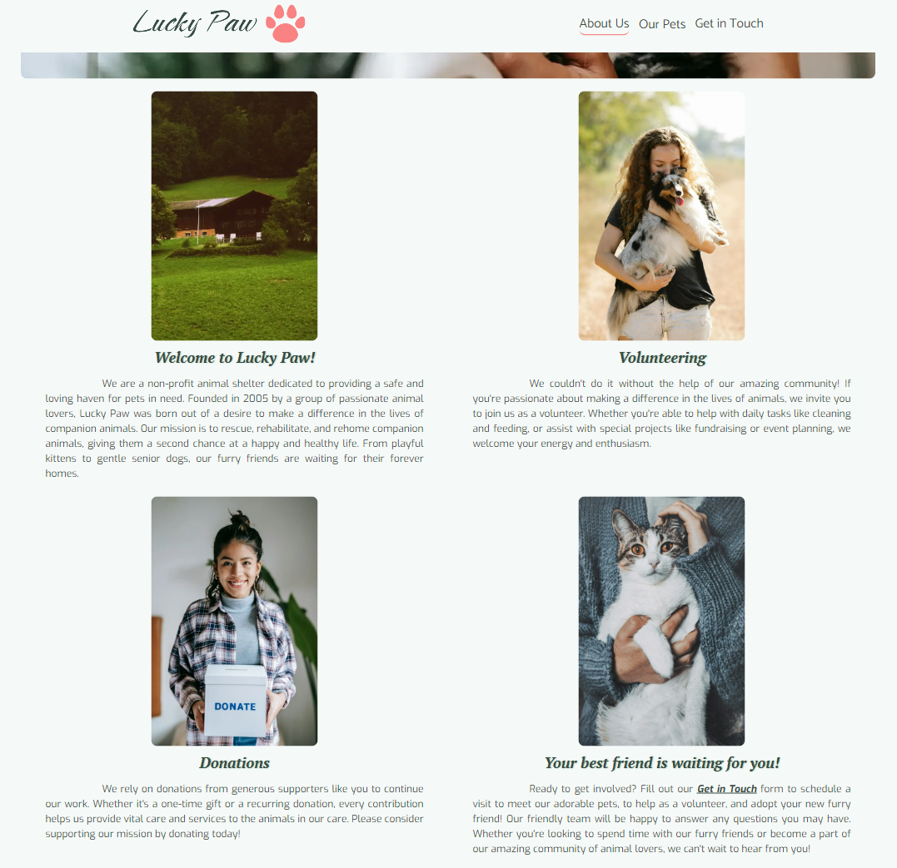
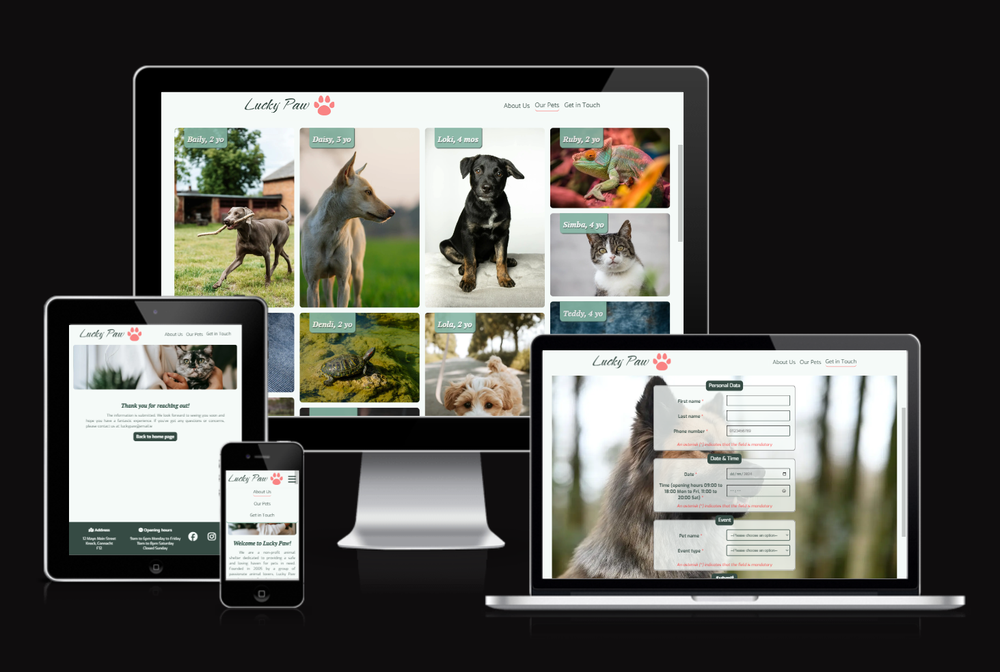

This project is a sample of a website for "Lucky Paw" animal shelter. Its goal is to help people find a pet to adopt. Users can find out about the pets online, schedule a visit and get information about the address and opening hours of the shelter. 

Click here to visit the [`Lucky Paw`](https://vl-ocean.github.io/lucky-paw/index.html) website 

## User Experience (UX)

 ### User stories
 #### 1. User stories based on business goals
- As an animal shelter owner, I want to familiarize users with the shelter and pets, so I can attract potential customers.
- As an animal shelter owner, I want to attract families, so I can find new homes for the pets.
- As an animal shelter owner, I want to familiarize users with the shelter and pets, so I can encourage them to donate.
#### 2. User stories based on customer needs
- As an ordinary person, I want to get pet information online, so I can save my time and resources. 
- As a shelter visitor, I want to schedule a time and date for a visit, so I can spend time with a particular pet that I like.

 ### Design
- ####  Color Scheme
  - The main color which was used mostly for the background, is #F5FAF8 Harp. Its pair as a main text color, footer and buttons color is #364B44 Mineral Green. For some shadows and accents was used #85B5A4 Acapulco. For the brighter accent was used #F98383 Geraldine. The design was planned as soft, nice to watch and simple.

- ####  Typography 
  - Three fonts are used from Google fonts which are: Catamaran, PT Serif and Exo. The main heading`s font is PT Serif italic. The navigation font is Catamaran and the text font is Exo.

- ####  Imagery
   - The hero image was used on every page of the website as part of the design scheme. The background of the contact page changes 3 times, depending on the screen width for the user`s comfort. The gallery page is bright and colorful due to pet images.

## Technologies Used 

 ### Languages Used 
- HTML5 
- CSS3

 ### Programes Used
 - #### [Git](https://gitpod.io/)
Git was used for version control by utilizing the Gitpod terminal to commit to Git and Push to GitHub.
  - #### [GitHub](https://github.com/)
GitHub is used to store the project's code after being pushed from Git.
  - #### [GitPod](https://www.gitpod.io/)
Gitpod was used as a platform to develop code in a ready-to-code developer environment.
 - #### [Balsamic](https://balsamiq.com/)
Balsamiq was used to create the wireframes during the design process

## Existing Features 
The website has five pages. Each page has a heading with a logo and a navigation bar (an icon for mobile) and a footer.

- ### Logo

 #### It informs the user about the organization's name. It's also clickable and returns the user to the main page from any other page on the website.

- ### Navigation

 

 #### The navigation bar provides the structure of the website. It shows the user what page it is on the screen. It gives the user the ability to move to any other page on the website.

- ### Footer

 #### The footer is divided into three sections. Users can find an address, opening hours, and links to the social media, which opens in a separate tab.

- ### Hero image

 #### It attracts the user's attention, showing the cat in the woman's hands, and it encourages the user to experience the happiness of having a pet. The hero image is present on all pages as part of the design.

- ### Home page 

 #### It contains four images, each having a heading and paragraph. The images support the content of the paragraph, increasing its effect. The layout of the images and text are changing depending on the device (mobile, tablet, desktop). In the last paragraph, there is an embedded link that takes the user to the contact page.

- ### Gallery page 

 #### The purpose of this page is to introduce the pets to the user. It has a heading and 23 pictures of different pets with their names and ages displayed at the top of the pictures. This page gives the user the possibility to choose a future pet and remember the name to use it later in the form.

- ### Contact page / Form

 #### This is the place where the user can schedule a visit to the center. Mandatory fields are marked for the user's convenience. 
 - The general information about the user is required such as name and phone number for contact in case of any changes. The phone number input does not allow to enter letters or more digits than necessary.
 - The calendar and time parts are provided to eliminate the need to type that information manually. The calendar is set to only allow the user to choose dates from 24.06.2024 to 31.12.2024 and time from 9 am to 8 pm. 
 - The event type is the reason for the visit and there is also a list of pets' names so that the user can specify who is to be visited/adopted. 

- ### Confirmation page 

 #### The user is assured that the form he filled has been received and will be processed. There is also an email address provided in case the user wants to cancel the appointment later.

- ### Custom 404 page 

 #### In case the user uses a broken link, he will land on the custom 404 page. It offers the user a link to go back to the home page and continue from there.

## Future features 
- Donation section/page
- News section/page
- Reviews section/page with visitors' reviews or/and pictures.
- The actual Gallery with photos of events or daily life of the pets.
- The button at the bottom of the gallery page leads the user straight to the contact page if the user wants to fill out the form right away.
- Dark Mode toggle

## Testing  

### Responsiveness
The website was developed from mobile (320px) to desktop (2000px) and was adapted to fit almost all screens. 

Screen resolution | Pass
--- | :---:
320px | &check;
576px | &check;
768px | &check;
992px | &check;
1024px | &check;
1600px | &check;
2000px | &check;

### Supported browsers
The website was tested on the following browsers and is working well:

Browser | Pass
--- | :---:
Chrome | &check;
Opera | &check;
Firefox | &check;
Microsoft Edge | &check;
Savannah | &check;

### Validator Testing 
- #### HTML
  - No errors or warnings to show.
    - [Home page](./README-images/home_page_validation.png)
    - [Gallery page](./README-images/gallery_page_validation.png)
    - [Contact page](./README-images/contact_page_validation.png)
    - [Confirmation page](./README-images/confirmation_page_validation.png)   
    - [Custom 404 page](./README-images/404page_validation.png.png)   
- #### CSS
  - No errors or warnings to show. (Except for the warning about imported Google Fonts "Imported style sheets are not checked in direct input and file upload modes")
    - [CSS validation](./README-images/css_validation.png)

### Accessibility and performance
  - Using Google Lighthouse I confirmed that the website is readable and accessible. It performs well.
    - [Home page](./README-images/home_page_lighthouse.png)
    - [Gallery page](./README-images/gallery_page_lighthouse.png)
    - [Contact page](./README-images/contact_page_lighthouse.png)
    - [Confirmation page](./README-images/confirmation_page_lighthouse.png)
    - [Custom 404 page](./README-images/404page_lighthouse.png)  

### Functional texting

Action |  Expected result | Pass
--- | --- | :---:
Click on the logo on the top left side of the website | Open the home page | &check;
Click on the icon of the menu (mobile) | Open the navigation menu | &check;
Click on the icon of the menu again (mobile) | Close the navigation menu | &check;
Click on the 'About us' navigation item | Open the home page | &check;
Click on the 'Our Pets' navigation item | Open the gallery page | &check;
Click on the 'Get in Touch' navigation item | Open the contact page | &check;
Click on the 'Facebook' footer icon | Open the Facebook page in a new tab | &check;
Click on the 'Instagram' footer icon | Open the Instagram page in a new tab | &check;
Click on the 'TikTok' footer icon | Open the TikTok page in a new tab | &check;
Click on the 'Submit' button without filling any fields on the form on the contact page  | Receive the message ['Please fill in this field'](./README-images/form_fname_message.png) | &check;
Fill in the first name only, then click on the 'Submit' button of the form on the contact page  | Receive the message ['Please fill in this field'](./README-images/form_lname_message.png) | &check;
Fill in the first name and the last name only, then click on the 'Submit' button of the form on the contact page | Receive the message ['Please fill in this field'](./README-images/form_tel_message.png) | &check;
Type in letters in the phone number field in the form on the contact page | Receive the message ['Please match the format requested'](./README-images/form_tel_format_message.png) | &check;
Type in 8 digits in the phone number field in the form on the contact page | Receive the message ['Please match the format requested'](./README-images/form_tel_format_incomplete_message.png) | &check;
Type in more than 10 digits in the phone number field in the form on the contact page | Extra digits are not displayed on the screen. Only the first 10 digits are accepted | &check;
Fill out the "Personal Data" section as per the format and requirements, then click on the 'Submit' button of the form on the contact page | Receive the message ['Please fill in this field'](./README-images/form_date_message.png) | &check;
Fill in the date (only the dates from 24.06.2024 to 31.12.2024 are accepted by the form, in Chrome it does not allow you to even try to choose another ['date'](./README-images/chrome_choose_date.png) or ['year'](./README-images/chrome_choose_year.png)), then click on the 'Submit' button of the form on the contact page  | Receive the message ['Please fill in this field'](./README-images/form_time_message.png) | &check;
Choose time outside working hours, then click on the 'Submit' button of the form on the contact page | Receive the message ['Value must be 09:00 or later'](./README-images/form_time_too_early.png) or ['Value must be 20:00 or earlier'](./README-images/form_time_too_late.png) | &check;
Fill out the "Personal Data" and "Date & Time" sections as per the format and requirements, then click on the 'Submit' button of the form on the contact page | Receive the message ['Please select an item in the list'](./README-images/form_pet_name_message.png) | &check;
Select the pet from the list, then click on the 'Submit' button of the form on the contact page  | Receive the message ['Please select an item in the list'](./README-images/form_event_message.png) | &check;
Fill out ['all sections'](./README-images/form_all_sections.png) as per the format and requirements, then click on the 'Submit' button of the form on the contact page | Open the confirmation page with a ['thank you'](./README-images/form_thank_you_message.png) message | &check;
Click on the 'Back to home page' button on the confirmation page  | Open the home page | &check;
Use the broken link to access the website, for example, 'https://vl-ocean.github.io/lucky-paw/ruby' | Open custom 404 page | &check;
Click on the 'Back to home page' button on the custom 404 page  | Open the home page | &check;

### User Stories testing

- As an ordinary person, I want to get pet information online, so I can save my time and resources. 
  - Once I click on the link of the website, I land on the home page. I see the information about the shelter, and how I can help them, and I also see the navigation menu. I click on "Our Pets" to go to the gallery page, where I can see the pets available for adoption. I can find their names and age. Once I choose a pet, I click on "Get in Touch" and fill out the form.

- As a shelter visitor, I want to schedule a time and date for a visit, so I can spend time with a particular pet that I like. 
  - Once I click on the link of the website, I land on the home page. I see the information about the shelter, and how I can help them, and I also see the navigation menu. I click on "Get in Touch" since I already know which pet I am interested in. I fill out the form, I can also select the pet name and the event type such as 'feed & bath' or 'playtime'. When I click on 'Submit', I get a confirmation that the form has been filled out. If I have any additional questions, I can use an email address to send an email. 

### Fixed Bugs

- The navigation menu wasn`t looking good on mobile due to its size. To fix it I followed the tutorial from Love Running project and added the checkbox. When using it, the navigation menu is placed in a separate container, which is shown only when you click on the icon. After you click on the icon again, the menu is hidden. It fixed the issue with displaying the navigation for mobile users.

- While testing the website using Lighthouse, the bug with icons appeared. They were too small to click on for mobile users. To fix that I removed the names of the social websites and left only the icons in the footer. I have increased them in size to make them usable for mobile users.

- When testing the form, I noticed that it became too wide for larger screens. To fix it, I limited the width of the form, and used flexbox to make lable and input the same row. As a result, the form looks better on larger screens and doesn`t take all the place on the page.

- After adding the background for tablet view on the contact page, the form wasn`t available for typing in or submitting. It happened because the container with the background image was overlapping the form itself. To make the form usable again I added z-index in CSS to the form.

- Due to the images' size Home page and Gallery page were dropping in Perfomance. To avoid it, all images were restocked in a smaller size and converted to Webp format. They were also optimized. As a result, the pages load much faster.

### Unfixed Bugs

- The form cannot be validated to specify the input characters. Currently, you can use digits as your name and surname. The day of the week cannot be validated either, the users can choose Sunday, even tho the shelter is closed at this time. The time input allows to choose 9am for Saturday and 8pm for weekdays, which is also incorrect. This can be fixed using JavaScript.

## Deployment
- ### Github pages
    - This project was deployed to GitHub Pages using the following steps
      - Log in to GitHub and locate the GitHub Repository
      - At the top of the Repository (not the top of the page), locate the "Settings" Button on 
        the menu.
      - Scroll down the Settings page until you locate the "GitHub Pages" Section.
      - Under "Source", click the dropdown called "None" and select "Master Branch".
      - The page will automatically refresh.
      - Scroll back down through the page to locate the now published site link in the "GitHub Pages" section.
      - live link for the page can be found here [Lucky Paw](https://vl-ocean.github.io/lucky-paw/index.html)
- ### Forking the GitHub Repository
    - By forking the GitHub Repository we make a copy of the original repository on our GitHub account to view and/or make changes without affecting the original repository by using the following steps
     - Log in to GitHub and locate the GitHub Repository
     - At the top of the Repository (not the top of the page) just above the "Settings" Button on the menu, locate the "Fork" Button.
     - You should now have a copy of the original repository in your GitHub account.
- ### Making a Local Clone
   - Log in to GitHub and locate the GitHub Repository
   - Under the repository name, click "Clone or download".
   -  To clone the repository using HTTPS, under "Clone with HTTPS", copy the link.
   - Open Git Bash
   - Change the current working directory to the location where you want the cloned directory to be made
   - Type git clone, and then paste the URL you copied in Step 3.
      - $ git clone https://github.com/YOUR-USERNAME/YOUR-REPOSITORY
   - Press Enter. Your local clone will be created.

## Credits 

  - ### Tutorials & Content
    - [Love Running project](https://github.com/Code-Institute-Solutions/love-running-v3) - The header and footer examples were taken from this project and customized. As well as the use of a hero image.    
    - [Code institute](https://learn.codeinstitute.net/) - The tutorials and videos were used to choose the elements and implement the styles.
    - [W3Schools](https://www.w3schools.com/) - The information about elements, values and attributes was used.
    - [MDN](https://developer.mozilla.org/en-US/) - The information about elements, values and attributes was used.
    - [Lake-dippers Readme](https://github.com/tmarkec/Lake-dippers)- The Readme file was used as an example for some sections and layouts in my Readme file.
    - [Bark 'n bath Readme](https://github.com/vtoth13/bark-n-bath/blob/main/README.md) - The Readme file was used as an example for some sections and layout in my Readme file. 
    - [GitHub Docs](https://docs.github.com/en) - The information was used to create and upload 404 page.

  - ### Graphics
    - [ColorSpace](https://mycolor.space/) - This tool was used to find the most suitable colors for the design.
    - [Adobe Color Contrast Checker](https://color.adobe.com/create/color-contrast-analyzer) - This tool was used to check contrast for text and background colors.
    - [Tinify image optimizer](https://tinypng.com/) - This tool was used to optimize the images.
    - [Convertio](https://convertio.co/) - This tool was used to convert JPEG files into WEBP file format.
    - [Cloudconvert](https://cloudconvert.com/) - This tool was used to convert JPEG files into WEBP file format.
    - [Pixelied](https://pixelied.com/convert/jpg-converter) - This tool was used to convert JPEG files into WEBP file format.
    - [Font Awesome](https://fontawesome.com/) - The icons on the website are taken from this library.
    - [Name that color](https://chir.ag/projects/name-that-color/#6195ED) - This tool was used to identify the names of the colors used for design.
    - [hex to rgba](https://rgbacolorpicker.com/hex-to-rgba) - This tool was used to convert hex value of color into rgba, for the form on the tablet layout.
    - [Google fonts](https://fonts.google.com/knowledge) - The Fonts were imported from this library.
    - [Fontjoy](https://fontjoy.com/) - This tool was used to find the matching font-families for the design.

  - ### Photos & Logo
    - [Pexels](https://www.pexels.com/) - The images on the website were taken from this library.
    - [Pixabay](https://pixabay.com/de/) - The images on the website were taken from this library.
    - [LOGO](https://logo.com/) - The logo has been created using the tools on this website.

  - ### Text content
    - [AI Text Generator](https://deepai.org/chat/text-generator) - The text content on the home page was generated using this tool.
    - [Fake address Generator](https://countryzipcode.com/fake-address-generator) - This tool was used to generate the fake address for the footer.

  - ### Acknowledgment
    - [Cohort Facilitator - Marko](https://github.com/tmarkec) for support in the classroom and guidance through the course.
    - [Mentor - Dick Vlaanderen](https://github.com/dickvla) for support throughout the project, ideas and advice.
    - My sister Anastasiia for help in design and graphic content.
